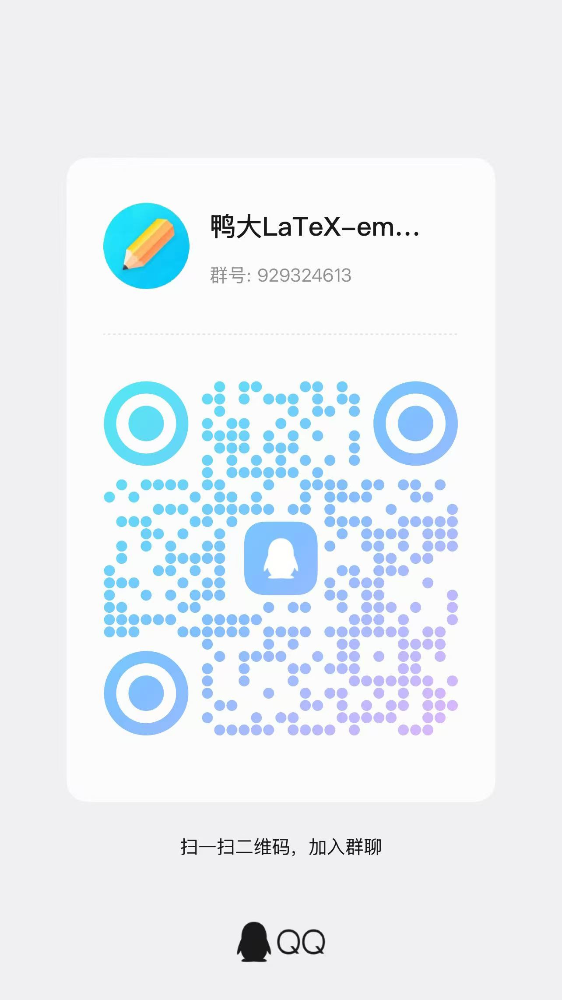

# 中山大学 $\LaTeX$ 毕业论文模板（本科/研究生）

[](https://github.com/SYSU-SCC/sysu-thesis/releases/latest)
[](https://github.com/SYSU-SCC/sysu-thesis/commits/master/)
[](https://github.com/SYSU-SCC/sysu-thesis/actions/workflows/test.yml)

本项目是中山大学的毕业论文/设计 LaTeX 模板 sysu-thesis，现已得到中山大学计算机学院等学院的支持，兼容最新版的 TeX Live、MacTeX 、MiKTeX 发行版，支持跨平台使用。

注意：

1. 使用说明文档 `sysuthesis-guide.pdf` 在发布版中附带，用户也可自行编译；**使用模板前应仔细阅读使用说明文档 `sysuthesis-guide.pdf`**。

2. 本科论文模板格式按照本科生论文规范编写，全校通用。研究生模板满足中法核工程与技术学院研究生论文格式要求的同时，也为其他学院提供可供使用和参考的模板。如遇格式问题，请及时提交 issue 或者通过QQ群反馈，QQ群号：929324613。

3. 本模板要求 TeX Live、MacTeX、MiKTeX 不低于 2020 年的发行版， 并且尽可能升级到最新。安装和升级方法见[新手指南](https://github.com/ustctug/ustcthesis/wiki/新手指南)。

4. **不支持** [CTeX 套装](https://github.com/ustctug/ustcthesis/wiki/常见问题#3-模板支持用-ctex-套装编译吗)。

**诚挚邀请广大校友加入本项目维护，希望加入 collaborator 团队的同学可联系 [@wu-kan](https://github.com/wu-kan)。**

## Star History:

[](https://starchart.cc/SYSU-SCC/sysu-thesis)

## 下载地址

- GitHub Releases：<https://github.com/SYSU-SCC/sysu-thesis/releases>

## 如何使用

### GitHub Actions 自动构建（在线）

点击 [Use this template](https://github.com/SYSU-SCC/sysu-thesis/generate) 创建自己的论文仓库（推荐创建为私有仓库），随后直接在自己的仓库进行修改，随后 GitHub Actions 会自动进行构建，可在 Actions 中下载对应 artifact。此处给出一个[示例](https://github.com/wu-kan/bachelor-thesis)。

还可以使用 `git tag`，其会像本仓库一样将构建好的 artifact 永久发布到 [releases](https://github.com/SYSU-SCC/sysu-thesis/releases) 中。

### Devcontainer 编辑（本地 & 在线）

> [!IMPORTANT]  
> 无论是本地还是在线编辑，都需要首先创建自己的论文仓库，在自己的仓库进行修改，并建议及时 `commit & push` 到远程仓库进行备份。

本模板提供了 [VS Code Remote - Containers](https://code.visualstudio.com/docs/remote/containers) 相关配置文件，包含了 texlive 2022 和 VS Code 中文和 LaTeX Workshop 插件，可用于本地或在线容器化编辑。

- 对于在线编辑，可以使用 [GitHub Codespaces](https://docs.github.com/zh/codespaces/developing-in-a-codespace/creating-a-codespace-for-a-repository) 通过浏览器版本的 VS Code 进行编辑。（请注意，GitHub Codespaces 每月免费额度有限，请注意用量）。
- 而对于本地编辑，需要安装 [Docker](https://docs.docker.com/get-docker/) 和 [VS Code](https://code.visualstudio.com/)，并在 VSCode 中安装 [Remote - Containers](https://marketplace.visualstudio.com/items?itemName=ms-vscode-remote.remote-containers) 插件。随后打开本仓库，键入 `F1`，选择 `Remote-Containers: Reopen in Container` 即可构建进入容器环境。

在容器环境中，可以使用 `make`（或 `make help`）查看所有可用的编译子命令。例如，使用 `make main` 进行编译并生成 `main.pdf` 文件，或者使用 LaTeX Workshop 插件进行编译与预览。

### TeX Live 编辑（本地）

本模板需要使用不低于 2020 年的 TeX Live 发行版进行编译，编译命令如下：

- 编译模板的使用说明文档 `sysuthesis-guide.pdf`：
   ```
   latexmk -xelatex sysuthesis-guide.tex
   ```
- 编译论文 `main.pdf`：
   ```
   latexmk -xelatex main.tex
   ```
- 如需清理论文编译过程中的临时文件，可以：
   ```
   latexmk -c
   ```

- 以上编译过程也可以用 `make` 工具：
   ```
   make doc        # 编译生成 sysuthesis-guide.pdf
   make            # 编译生成论文 main.pdf
   make clean      # 删除编译过程中生成的临时文件
   ```

如有环境问题，推荐对照 [GitHub Actions](./.github/workflows/test.yml) 中的环境进行配置。


## 需要注意的问题

1. 字体问题，见 [#29](https://github.com/SYSU-SCC/sysu-thesis/issues/29)

## 相关规范

1. [本科生](https://spa.sysu.edu.cn/zh-hans/article/1744)
2. [研究生](https://lifesciences.sysu.edu.cn/sites/default/files/2025-03/中山大学研究生学位论文格式要求.pdf)

## 关于展示

答辩展示的样式涉及到不同人的需求，且学校未对格式做要求，因此目前本仓库提供了一个最简单的模板供大家学习和上手调整，在 overleaf 中使用时需要点击 `menu`，滑动到下方 `Settings` 的 `Main document` 选择 `pre.tex`。此处给出 [overleaf 的 Beamer 教程](https://overleaf.com/learn/latex/Beamer)。

我们欢迎大家自己定制一些符合自己要求的模板，并向我们提交 PR，在下方增加一个指向你的模板的链接作为推荐，参见 [#65](https://github.com/SYSU-SCC/sysu-thesis/issues/65) 。

- 中大官微模板：[2023](https://mp.weixin.qq.com/s/B5vDwqDRvPbPnlbXye1dFA)、[2024（百年校庆）](https://mp.weixin.qq.com/s/EQtiV_7qflidBKk-MtrnuQ)、[2025](https://mp.weixin.qq.com/s/JE7-Y3qww-O7hGhVQxBbvQ)、[2026](https://mp.weixin.qq.com/s/hY1a6V5lpVSz4058A4fdog)
- [Lovely-XPP/SYSU-PRE](https://github.com/Lovely-XPP/SYSU-PRE)
- [NelsonCheung-cn/SYSU-beamer-template](https://github.com/NelsonCheung-cn/SYSU-beamer-template)
- [Very-White/sysu_ppt_template](https://github.com/Very-White/sysu_ppt_template)

## 反馈问题

如果发现模板有问题，请按照以下步骤操作：

1. 阅读学校的标准，判断是否符合学校的要求：[本科生论文规范](https://spa.sysu.edu.cn/zh-hans/article/1744)；[研究生论文规范](https://lifesciences.sysu.edu.cn/sites/default/files/2025-03/中山大学研究生学位论文格式要求.pdf)；
2. 阅读 [常见问题 FAQ](https://github.com/ustctug/ustcthesis/wiki/常见问题)；
3. 将 TeX 发行版和宏包升级到最新，并且将模板升级到 Github 上最新版本，查看问题是否已经修复；
4. 在 [GitHub Issues](https://github.com/ustctug/ustcthesis/issues)中搜索该问题的关键词；
5. 在 [GitHub Issues](https://github.com/1FCENdoge/sysuthesis/issues)中提出新 issue。

如果导师或者院系在格式上有额外的要求，请将老师的邮件截图放在 issue 中或者在QQ群中反馈。作者会考虑增加接口以便修改格式。QQ群号：929324613，或者扫描下方二维码：


## 更多资料

- [LaTeX 新手入门指南](https://github.com/ustctug/ustcthesis/wiki/新手指南)
- [常见问题 FAQ](https://github.com/ustctug/ustcthesis/wiki/常见问题)
- [参与开发](https://github.com/ustctug/ustcthesis/wiki/参与开发)
